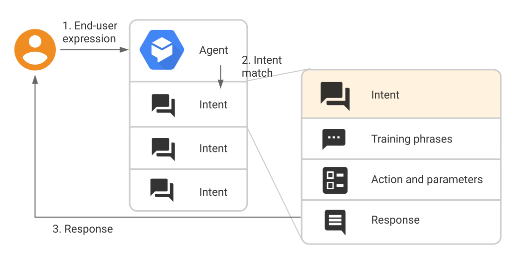

# Hermes

## Deployment

`profile=karros-lab`

`sam build`

`sam deploy --profile ${profile}`

## Features

- Check the SLA
- Check status on-demand: service, api, website
- Create SLA

## Intents

check profile

story of hermes

## Training phrases

## Action

- send request to check sla
- send the introduction about Hermes

## Parameters

- sla_name:
  - entity_type: string
- service_name:
  - entity_type: string
- website_url:
  - entity_type: @sys.url
- api

## Responses

Text, speech, or visual responses to return to the end-user.

## Contexts

## Follow-up intents

## Dialogflow Hangouts integration

## Notes

GoogleChat Card Message: maximum characters: "System Management, feature flag endpoint return"
-> 48 characters.
